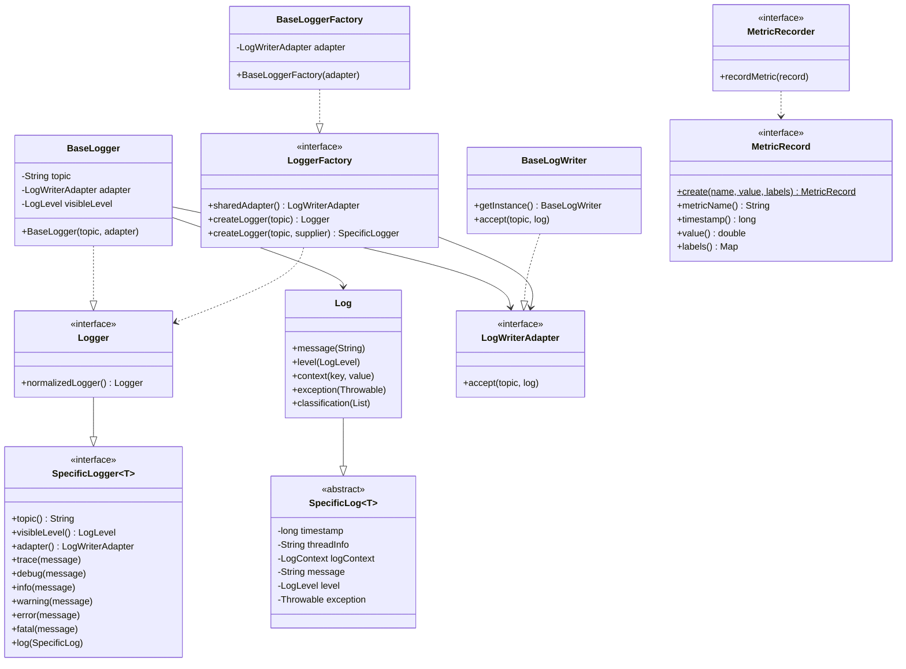

# Keel Logger API

Keel Logger API 是一个灵活且可扩展的 Java 日志 SDK，旨在提供结构化、上下文感知的日志记录能力和定量指标记录功能。

## 项目信息

- **版本**: 
- **Java 版本**: 17+
- **构建工具**: Gradle
- **许可证**: GPL-v3.0
- **仓库地址**: [https://github.com/sinri/keel-logger-api](https://github.com/sinri/keel-logger-api)
- **Maven 坐标**: `io.github.sinri:keel-logger-api:5.0.0`

## 核心特性

- ✨ **结构化日志** - 支持消息、上下文、异常、分类等结构化信息
- 📊 **多级别日志** - 8 个日志级别（TRACE、DEBUG、INFO、NOTICE、WARNING、ERROR、FATAL、SILENT）
- 🔌 **适配器模式** - 通过 `LogWriterAdapter` 自定义日志输出方式
- 🏭 **工厂模式** - 通过 `LoggerFactory` 统一创建和管理 Logger 实例
- 🔧 **高度扩展** - 支持自定义 `SpecificLog` 和 `SpecificLogger`
- ⚡ **性能优化** - 日志级别前置检查，避免不必要的对象创建
- 📈 **指标记录** - 内置 `MetricRecorder` 接口用于定量指标和时序数据记录

## 快速开始

### 依赖配置

**Gradle (Kotlin DSL)**:

```kotlin
dependencies {
    implementation("io.github.sinri:keel-logger-api:5.0.0-SNAPSHOT")
}
```

**Maven**:

```xml
<dependency>
    <groupId>io.github.sinri</groupId>
    <artifactId>keel-logger-api</artifactId>
    <version>5.0.0-SNAPSHOT</version>
</dependency>
```

### 基础使用

```java
import io.github.sinri.keel.logger.api.LogLevel;
import io.github.sinri.keel.logger.api.logger.BaseLogger;
import io.github.sinri.keel.logger.api.logger.Logger;

// 创建 Logger 实例
Logger logger = new BaseLogger("my-app");

        // 设置可见日志级别
logger.

        visibleLevel(LogLevel.DEBUG);

        // 记录不同级别的日志
logger.

        trace("trace message");
logger.

        debug("debug message");
logger.

        info("info message");
logger.

        notice("notice message");
logger.

        warning("warning message");
logger.

        error("error message");
logger.

        fatal("fatal message");
```

### 上下文日志

使用 `LogContext` 记录结构化的上下文信息：

```java
logger.info("User login",context ->{
        context.

put("userId","12345");
    context.

put("username","john_doe");
    context.

put("ip","192.168.1.1");
});

        // 或使用 Consumer 方式构建复杂日志
        logger.

info(log ->{
        log.

message("Order created");
    log.

context("orderId","ORD-2024-001");
    log.

context("amount",299.99);
    log.

context("currency","USD");
});
```

### 异常日志

记录异常信息及其上下文：

```java
try{
// 业务逻辑

processOrder(orderId);
}catch(
        Exception e){
        logger.

        error(log ->{
        log.

        message("Failed to process order");
        log.

        exception(e);
        log.

        context("orderId",orderId);
        log.

        context("errorCode","PROCESS_FAILED");
    });
            }
```

### 指标记录

使用 `MetricRecord` 记录定量指标，适用于时序数据、性能指标、业务指标等场景：

```java
import io.github.sinri.keel.logger.api.metric.MetricRecord;
import io.github.sinri.keel.logger.api.metric.MetricRecorder;

import java.util.Map;

// 创建带标签的指标记录
Map<String, String> labels = Map.of(
        "env", "production",
        "service", "order-service",
        "region", "us-east-1"
);

        MetricRecord record = MetricRecord.create(
                "order.processing.duration",  // 指标名称
                142.5,                         // 指标值
                labels                         // 标签
        );

        // 使用 MetricRecorder 记录指标
        MetricRecorder recorder = getMetricRecorder();
recorder.

        recordMetric(record);

        // 或使用指定时间戳
        MetricRecord customRecord = MetricRecord.create(
                System.currentTimeMillis(),
                "cpu.usage.percent",
                78.5,
                Map.of("host", "server-01")
        );
```

## 进阶使用

### 自定义适配器

实现 `LogWriterAdapter` 接口自定义日志输出方式：

```java
import io.github.sinri.keel.logger.api.adapter.LogWriterAdapter;
import io.github.sinri.keel.logger.api.log.SpecificLog;

public class CustomLogWriter implements LogWriterAdapter {
    @Override
    public void accept(String topic, SpecificLog<?> log) {
        // 自定义日志处理逻辑
        // 例如：写入数据库、发送到远程服务器、格式化输出等
        String formattedLog = String.format(
                "[%s] [%s] %s - %s",
                log.timestamp(),
                log.level(),
                topic,
                log.message()
        );

        // 输出到自定义目标
        System.out.println(formattedLog);
    }
}

// 使用自定义适配器
LogWriterAdapter adapter = new CustomLogWriter();
Logger logger = new BaseLogger("my-app", adapter);
```

### 工厂模式

使用 `LoggerFactory` 统一创建和管理 Logger 实例：

```java
import io.github.sinri.keel.logger.api.factory.BaseLoggerFactory;
import io.github.sinri.keel.logger.api.factory.LoggerFactory;

// 创建工厂实例（共享同一个适配器）
LoggerFactory factory = new BaseLoggerFactory(customAdapter);

        // 为不同主题创建 Logger
        Logger authLogger = factory.createLogger("auth");
        Logger orderLogger = factory.createLogger("order");
        Logger paymentLogger = factory.createLogger("payment");

        // 所有 Logger 共享同一个适配器
authLogger.

        info("User logged in");
orderLogger.

        info("Order created");
paymentLogger.

        info("Payment processed");
```

### 自定义日志类型

扩展 `SpecificLog` 和 `SpecificLogger` 实现自定义日志类型：

```java
import io.github.sinri.keel.logger.api.log.SpecificLog;

// 自定义日志类型

public class AuditLog extends SpecificLog<AuditLog> {
    private String userId;
    private String action;
    private String resource;

    public AuditLog userId(String userId) {
        this.userId = userId;
        return this;
    }

    public AuditLog action(String action) {
        this.action = action;
        return this;
    }

    public AuditLog resource(String resource) {
        this.resource = resource;
        return this;
    }

    // Getters...
}

        // 使用自定义日志类型
        SpecificLogger<AuditLog> auditLogger = factory.createLogger(
                "audit",
                AuditLog::new
        );

auditLogger.

        info(log ->{
        log.

        message("Resource accessed");
    log.

        userId("user-123");
    log.

        action("READ");
    log.

        resource("/api/users/123");
});
```

## 开发要约

### 构建项目

```bash
./gradlew build
```

### 运行测试

```bash
./gradlew test
```

### 生成 JavaDoc

```bash
./gradlew javadoc
```

生成的文档位于 `build/docs/javadoc/` 目录。

### 发布到仓库

项目根据版本号自动选择发布目标：

- **SNAPSHOT 版本**或**带字母后缀的版本**（如 `5.0.0-rc.21`）将发布到内部 Nexus
- **正式版本**（如 `5.0.0`）将发布到 Maven Central（通过 Sonatype Central Portal 的兼容 Staging API）

**发布命令**:

```bash
./gradlew publish
```

> **注意**:
> - 发布需要配置相应的认证凭据
> - 内部 Nexus 需要配置: `internalNexusUsername`, `internalNexusPassword`, `internalNexusSnapshotsUrl`, `internalNexusReleasesUrl`
> - Maven Central（Sonatype Central Portal）需要在 `~/.gradle/gradle.properties` 中配置: `sonatypeUsername`, `sonatypePassword`
> - 正式版本发布时会自动进行 GPG 签名

如需显式执行“发布到 Central + 自动 close + release”，可以使用插件提供的任务组合：

```bash
./gradlew publishToSonatype closeAndReleaseSonatypeStagingRepository
```

如遇到任务名差异（`...Repository` / `...Repositories`），可先查看 publishing 分组下的任务列表：

```bash
./gradlew tasks --group=publishing
```

## 架构说明



### 设计模式

- **适配器模式**: `LogWriterAdapter` 允许自定义日志输出方式（控制台、文件、数据库、远程服务等）
- **工厂模式**: `LoggerFactory` 统一创建和管理 Logger 实例，共享适配器
- **构建器模式**: 通过 Consumer 函数式接口构建复杂的日志对象
- **模板方法**: `SpecificLog` 和 `SpecificLogger` 提供扩展点

## 许可证

本项目采用 [GPL-v3.0](https://www.gnu.org/licenses/gpl-3.0.txt) 许可证。

## 贡献者

- [Sinri Edogawa](mailto:e.joshua.s.e@gmail.com)

---

**相关资源**:

- [JavaDoc 文档](https://sinri.github.io/keel-logger-api/)
- [GitHub Issues](https://github.com/sinri/keel-logger-api/issues)
- [更新日志](https://github.com/sinri/keel-logger-api/releases)
